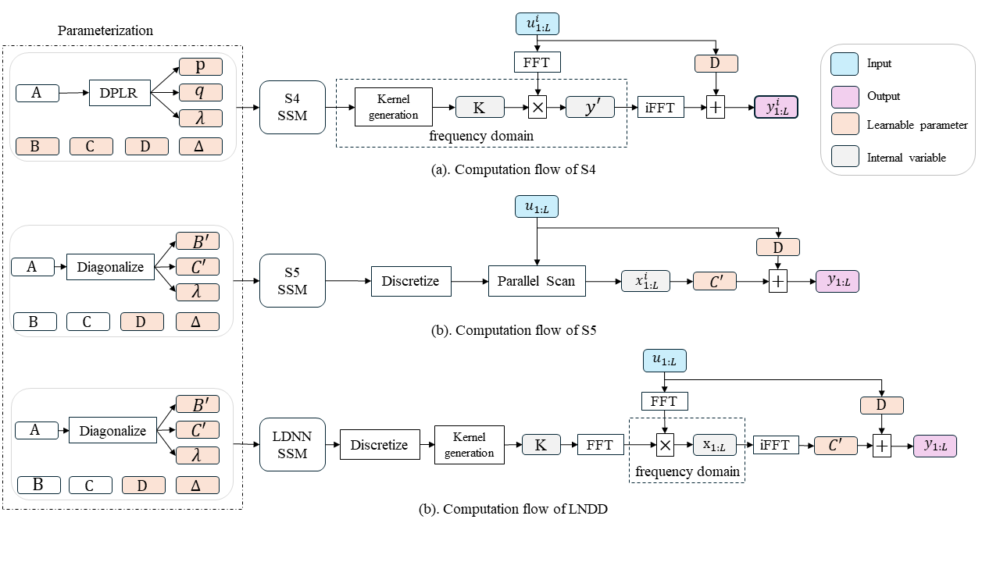

# Linear Dynamics-embedded Neural Network
  

This repository contains the implementation code for paper:

> **Linear Dynamics-embedded Neural Network for Long-Sequence Modeling**\
> [Tongyi Liang](https://github.com/leonty1.html), [Han-Xiong Li](https://scholar.google.com/citations?user=tnnePQwAAAAJ.html).\
> Appendix Preprint: https://arxiv.org/abs/2402.15290 \
> Under Review by IEEE, 2024. 

## Graph Abstract

      

## Table of Contents
Our code is developed based on S4 work ([paper](https://arxiv.org/abs/2111.00396)). Thanks! Code structure is organized as:

* `configs/` : configurations for all experiments.
* `src/` : model.
* `train.py` : training model with given configurations.

## Setup

### Requirements
This repository requires Python 3.8+ and Pytorch 2.0+. Please be careful about the PyTorch and python version, and all other packages can be installed via `pip install -r requirements.txt` or 'conda env create -f environment.yaml'.

Set 'os.environ\["PL_TORCH_DISTRIBUTED_BACKEND"] = "gloo" ' for windows environment, and 'os.environ\["PL_TORCH_DISTRIBUTED_BACKEND"] = "nccl" ' for Linux in 'train.py''.

Our code can also work at [dss](https://github.com/state-spaces/s4) environment by putting our model into corresponding folders. 

### Data
We follow all datasets setup as introduced in [DSS](https://github.com/state-spaces/s4).

### Experiments
Run experiments with command like 'python -m train wandb=null experiment=ldnn-ssm-lra-cifar'.

## Model Comparison
Our LDNN is buildt on state space model with multi-input and multi-output. The follow figure shows the comparison of computational flow of S4 ([paper](https://arxiv.org/abs/2111.00396)), S5([paper](https://arxiv.org/abs/2208.04933)) and LDNN

      

## Contact
Pre-trained models available upon email request.
If you need, please contact us through email (t.y.liang@my.cityu.edu.hk, mehxli@cityu.edu.hk).